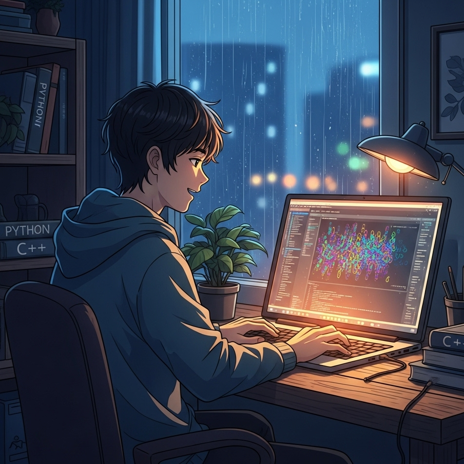

<h1 align="center">
Hi, I'm Gustavo Hernandez!
  </h1>
 <!---->
 <!-- <a href="https://github.com/I-am-vishalmaurya/I-am-vishalmaurya/"> </a> -->
<br/>

<p align="center">
  <a href="https://git.io/typing-svg">
    
  </a>
</p>



<hr>

```
I-am-ergusha11@github
-------------------------
💻 I am a self taught Web Developer and a IA Developer
📚 I have a Bachelors in Artificial Intelligence Engineer from ESCOM in Mexico City, Mexico 
📝 I have a strong interest in Data Science and Artificial Intelligence
🔭 Working on Deep Learning & Machine Learning
🌱 Learning about Computer Vision and Machine Learning stuff
🌟 Main languages: Python, C++ and Java
🚩 Interested in Full Stack Machine Learning Application development
💖 In a complicated relationship with Neural Networks
🎵 Love pop, lofi, jazz and soft music
```
<hr>
